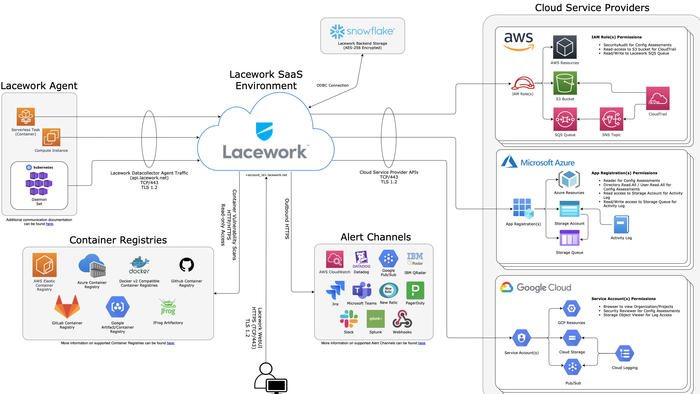

# Lacework Trial

You plan to do a trail of Lacework? Great! This repository helps you to quickly find the necessary information for a successful trial of the Lacework solution. The target is to have a full overview of all the Lacework use cases including instructions how to configure and test them.

# How to start?

First of all we recommend starting with the [Getting Started with Lacework](#getting-started-with-lacework) overview to get a basic understanding about the Lacework Platform and the different use cases.

## Architecture Overview
The following diagram gives you a high level overview about the different components when using the Lacework platform.

In general there are many deployment options for Lacework including manual deployments. However, nearly all of our customers are using our Terraform [Provider](https://registry.terraform.io/search/providers?q=lacework) and [Modules](https://registry.terraform.io/search/modules?q=lacework) to simplify the onboarding and ongoing management of Lacework as Infrastructure as Code. For this approach we recommend to begin with the [Getting Started with Terraform for Lacework](#getting-started-with-terraform-for-lacework).

Based on your trail testing plans we need to separate between **agentless** and **agent based**.

### Agentless

On the agentless side we need to separate between **Compliance**, **User Entity Behaviour Analytics** and **Container Vulnerability Scanning**. Depending on your use cases and cloud environments you plan to onboard during a trial we recommend to start for AWS with the [Integrate Lacework with AWS](#integrate-lacework-with-aws) for GCP with [Integrate Lacework with GCP](#integrate-lacework-with-gcp) the and for Azure with the [Integrate Lacework with Azure](#integrate-lacework-with-azure). For the Container Vulnerability Scanning we recommend to start with [Container vulnerability](#container-vulnerability) and pre check the supported **Operating Systems** and **Container Registries** at the [Container Vulnerability Assessment Overview](https://support.lacework.com/hc/en-us/articles/360035472393-Container-Vulnerability-Assessment-Overview) overview.

### Agent based

On the agent based side you need to make sure that your **Operating System** is on the list of [Supported Operating Systems](https://support.lacework.com/hc/en-us/articles/360005230014-Supported-Operating-Systems) and that you can make sure that all agents have the [Required Connectivity, Proxies and Certificates](https://support.lacework.com/hc/en-us/articles/360008149354-Required-Connectivity-Proxies-Certificates). For the Agent we have several [Agent Install Options](#agent-install-options). The agent has several capabilities and we recommend to do a read through of the [Features and Configuration](#features-and-configuration) section.

After finishing the onboarding of your cloud accounts, registries and agents you can start to focus on [Authentication and Team Members](#authentication-and-team-members) and also the [Alert Routing](#alert-routing)

Now you should be ready to go an in the next section we will focus more in detail on specific use cases and how you can test them during your trial.

# Use Cases

The following is a list of all the use cases customers typically want to test during a trial of the Lacework platform. Each Use Case has a unique ID. The idea here is to extend the use cases over time and with the grow of the feature set of our platform.

## Agentless

### CSPM - Cloud COMPLIANCE

#### AWS COMPLIANCE

#### Azure Compliance

#### GCP Compliance

### CSPM - Cloud Resource Management

### CSPM+ - User Entity Behaviour Analytics

#### AWS UEBA

#### Azure UBEA

#### GCP UBEA

## Agent based

### Vulnerability Management

#### Vulnerability Management for Container

#### Vulnerability Management for Hosts

### HIDS (Host Intrusion Detection System)

#### Workload Security

#### Container and Kubernetes Security

### Alerting

### Authentication

# Documentation

The following are quick links to the Lacework documentation to quickly find specific sections for your trial need. The last update of the links was done on the **23th of June 2021**

## Getting Started with Lacework
* [Lacework Overview](https://support.lacework.com/hc/en-us/articles/360040977454-Lacework-Overview)
* [Configure Lacework](https://support.lacework.com/hc/en-us/articles/360017546933-Configure-Lacework)
* [Use the global dashboard and search](https://support.lacework.com/hc/en-us/articles/360021458673-Use-the-Global-Dashboard-and-Search)

## Getting Started with Terraform for Lacework
* [Terraform for Lacework Overview](https://support.lacework.com/hc/en-us/articles/360061585353-Terraform-for-Lacework-Overview)
* [Managing Alert Channels with Terraform](https://support.lacework.com/hc/en-us/articles/1500001987702-Managing-Alert-Channels-with-Terraform)

## Resource Inventory
* [Manage Integrated AWS Resources](https://support.lacework.com/hc/en-us/articles/360053927513-Manage-Integrated-AWS-Resources)

## Policies
* [Use Policies](https://support.lacework.com/hc/en-us/articles/360023758713-Use-Policies)
* [Suppress Behavior Anomaly Alerts](https://support.lacework.com/hc/en-us/articles/360038090714-Suppress-Behavior-Anomaly-Alerts)
* [Suppress Crawler Related Alerts](https://support.lacework.com/hc/en-us/articles/360054841314-Suppress-Crawler-Related-Alerts)

## Lacework for Workload Security

### Before you Start
* [Supported Operating Systems](https://support.lacework.com/hc/en-us/articles/360005230014-Supported-Operating-Systems)
* [Required Connectivity, Proxies and Certificates](https://support.lacework.com/hc/en-us/articles/360008149354-Required-Connectivity-Proxies-Certificates)
* [Initial Data Visibility in the Lacework Console](https://support.lacework.com/hc/en-us/articles/360005324633-Initial-Data-Visibility-in-the-Lacework-Console)

### Agent Install Options
* [Agent Installation Prerequisites](https://support.lacework.com/hc/en-us/articles/1500007191502-Agent-Installation-Prerequisites)
* [Create Agent Access Tokens and Download the Agent Installers](https://support.lacework.com/hc/en-us/articles/360036425594-Create-Agent-Access-Tokens-and-Download-Agent-Installers)
* [Use the Lacework Installation Script](https://support.lacework.com/hc/en-us/articles/360005321273-Use-the-Lacework-Installation-Script-install-sh-)
* [Install with Chef](https://support.lacework.com/hc/en-us/articles/360005321413-Install-with-Chef)
* [Install from APT and YUM Repositories](https://support.lacework.com/hc/en-us/articles/360023100733-Install-from-APT-and-YUM-Repositories)
* [Install using a .deb or .rpm Package](https://support.lacework.com/hc/en-us/articles/360005262974-Install-using-a-deb-or-rpm-Package)
* [Install with Ansible](https://support.lacework.com/hc/en-us/articles/360005321433-Install-with-Ansible)
* [Install on a Dockerized Host](https://support.lacework.com/hc/en-us/articles/360005262994-Install-on-a-Dockerized-Host)
* [Install using Docker Compose](https://support.lacework.com/hc/en-us/articles/360005321473-Install-using-Docker-Compose)
* [Deploy on Kubernetes](https://support.lacework.com/hc/en-us/articles/360005263034-Deploy-on-Kubernetes)
* [AWS ECS Fargate](https://support.lacework.com/hc/en-us/articles/360055567574-AWS-ECS-Fargate)
* [Install on Alpine Linux](https://support.lacework.com/hc/en-us/articles/360052924153-Install-on-Alpine-Linux)
* [Install on CoreOS](https://support.lacework.com/hc/en-us/articles/360006099534-Install-on-CoreOS)
* [Use Packer to Create a Machine Image with an Installed Agent](https://support.lacework.com/hc/en-us/articles/360050017693-Use-Packer-to-Create-a-Machine-Image-with-an-Installed-Agent)
* [Uninstall the Lacework Agent](https://support.lacework.com/hc/en-us/articles/360005324533-Uninstall-the-Lacework-Agent)
* [Install the Lacework Agent on Hosts with the Lacework CLI](https://support.lacework.com/hc/en-us/articles/360059968374-Install-the-Lacework-Agent-on-Hosts-with-the-Lacework-CLI)
* [Install Agent on AWS EC2 Instances using Terrafrom and AWS System Manager](https://support.lacework.com/hc/en-us/articles/1500003531682-Install-Agent-on-AWS-EC2-Instances-Using-Terraform-and-AWS-Systems-Manager)
* [Deploy to Kubernetes with Terraform](https://support.lacework.com/hc/en-us/articles/1500003824601-Deploy-to-Kubernetes-with-Terraform)

### Features and Configuration
* [Usage Impact of Agent Deployment](https://support.lacework.com/hc/en-us/articles/360047019354-Usage-Impact-of-Agent-Deployment)
* [Configure Agent Behavior in confg.json file](https://support.lacework.com/hc/en-us/articles/360024365753-Configure-Agent-Behavior-in-config-json-File)
* [Agent Access Tokens](https://support.lacework.com/hc/en-us/articles/360005318133-Agent-Access-Tokens)
* [Agent Administration](https://support.lacework.com/hc/en-us/articles/360005265194-Agent-Administration)
* [Polygraph Diff Selector and Search](https://support.lacework.com/hc/en-us/articles/360034692034-Polygraph-Diff-Selector-and-Search)
* [Mismatch Between Docker and Machine Hostnames](https://support.lacework.com/hc/en-us/articles/360005265554-Mismatch-Between-Docker-and-Machine-Hostnames)
* [Add Agent Tags](https://support.lacework.com/hc/en-us/articles/360008466893-Add-Agent-Tags)
* [Add the Name field to the Machine Properties Table](https://support.lacework.com/hc/en-us/articles/360008318373-Add-the-Name-field-to-the-Machine-Properties-Table)
* [How Lacework Derives the Kubernetes Cluster Name](https://support.lacework.com/hc/en-us/articles/360050328914-How-Lacework-Derives-the-Kubernetes-Cluster-Name)
* [View K8s Cluster or Node Types in Lacework Console](https://support.lacework.com/hc/en-us/articles/360021406794-View-K8s-clusters-or-node-types-in-Lacework-Console)
* [Change Agent Resource Installation Limits on K8s Environments](https://support.lacework.com/hc/en-us/articles/360056728813-Change-Agent-Resource-Installation-Limits-on-K8s-Environments)
* [Agent Server URL](https://support.lacework.com/hc/en-us/articles/1500007918841-Agent-Server-URL)

### Host Vulnerability Assessment
* [Host Vulnerability Assessment Overview](https://support.lacework.com/hc/en-us/articles/360049666194-Host-Vulnerability-Assessment-Overview)
* [When Host Assessments Identify a Vulnerability as Fixed](https://support.lacework.com/hc/en-us/articles/360053592234-When-Host-Assessments-Identify-a-Vulnerability-as-Fixed)
* [Multiple Fixed Parallel Package Versions](https://support.lacework.com/hc/en-us/articles/360052082074-Multiple-Fixed-Parallel-Package-Versions)
* [When Host Assessment Metrics Carry-Forward](https://support.lacework.com/hc/en-us/articles/360050511453-When-Host-Assessment-Metrics-Carry-Forward)

### Host and Containers Dossiers
* [Dossier Navigation and Filters](https://support.lacework.com/hc/en-us/articles/360035353714-Dossier-Navigation-and-Filters)
* [Application Dossier](https://support.lacework.com/hc/en-us/articles/360035352394-Applications-Dossier)
* [Containers Dossier](https://support.lacework.com/hc/en-us/articles/360035352414-Containers-Dossier)
* [Files FIM Dossier](https://support.lacework.com/hc/en-us/articles/360035353794-Files-FIM-Dossier)
* [Kubernetes Dossier](https://support.lacework.com/hc/en-us/articles/360035352474-Kubernetes-Dossier)
* [Machine Dossier](https://support.lacework.com/hc/en-us/articles/360035832133-Machines-Dossier)
* [Network Dossier](https://support.lacework.com/hc/en-us/articles/360035832113-Networks-Dossier)
* [Processes Dossier](https://support.lacework.com/hc/en-us/articles/360035352454-Processes-Dossier)
* [Users Dossier](https://support.lacework.com/hc/en-us/articles/360035352434-Users-Dossier)

## Lacework for AWS

### Integrate Lacework with AWS
* [AWS Config and CloudTrail Integration with Terraform](https://support.lacework.com/hc/en-us/articles/360057092034-AWS-Config-and-CloudTrail-Integration-with-Terraform)
* [AWS Config and CloudTrail Integration with Terraform in AWS CloudShell](https://support.lacework.com/hc/en-us/articles/360062637313-AWS-Config-and-CloudTrail-Integration-with-Terraform-in-AWS-CloudShell)
* [Initial Setup of AWS Config Integration](https://support.lacework.com/hc/en-us/articles/360005333493-Initial-Setup-of-AWS-Config-Integration)
* [Initial Setup of AWS GovCloud Integration](https://support.lacework.com/hc/en-us/articles/360021140214-Initial-Setup-of-AWS-GovCloud-Integration)
* [Initial Setup of Snowflake Integration to Access AWS CloudTrail Event Data - Beta](https://support.lacework.com/hc/en-us/articles/360024096013-Initial-Setup-of-Snowflake-Integration-to-Access-AWS-CloudTrail-Event-Data-Beta)
* [Setup of Organization AWS CloudTrail Integration](https://support.lacework.com/hc/en-us/articles/360055993554-Setup-of-Organization-AWS-CloudTrail-Integration)
* [Multiple AWS Account Integration](https://support.lacework.com/hc/en-us/articles/360011511373-Multiple-AWS-Account-Integration)
* [Integration with S3 Bucket Using Server-Side-Encryption with AWS KMS Managed Keys](https://support.lacework.com/hc/en-us/articles/360019127414-Integration-with-S3-Buckets-Using-Server-Side-Encryption-with-AWS-KMS-Managed-Keys)

### Use Lacework for AWS

* [Understand the AWS Compliance Dashboard Page](https://support.lacework.com/hc/en-us/articles/360020690814-Understand-the-AWS-Compliance-Dashboard-Page)
* [Understand the AWS Compliance Reports](https://support.lacework.com/hc/en-us/articles/360020691574-Understand-the-AWS-Compliance-Reports)
* [AWS Compliance Reports Using Suppression](https://support.lacework.com/hc/en-us/articles/360019235394-AWS-Compliance-Reports-Using-Suppression)
* [Advanced Suppression Tag Matrix](https://support.lacework.com/hc/en-us/articles/360021591633-Advanced-Suppression-Tag-Matrix)
* [Understand the AWS Compliance Summary](https://support.lacework.com/hc/en-us/articles/360020692074-Understand-the-AWS-Compliance-Summary)
* [Understand the AWS CloudTrail Page](https://support.lacework.com/hc/en-us/articles/360020960873-Understand-the-AWS-CloudTrail-Page)
* [Update AWS Account Name in Lacework Console](https://support.lacework.com/hc/en-us/articles/360013639414-Update-AWS-Account-Name-in-Lacework-Console)

## Lacework for Azure

### Integrate Lacework with Azure
* [Azure Compliance Activity Log Integrations Terraform using Azure Cloud Shell](https://support.lacework.com/hc/en-us/articles/360057092134-Azure-Compliance-Activity-Log-Integrations-Terraform-using-Azure-Cloud-Shell)
* [Azure Compliance Activity Log Integrations Terraform from any supported Host](https://support.lacework.com/hc/en-us/articles/360058966313-Azure-Compliance-Activity-Log-Integrations-Terraform-From-Any-Supported-Host)
* [Azure Compliance Integration Manually using the Azure Portal](https://support.lacework.com/hc/en-us/articles/360024722453-Azure-Compliance-Integration-Manually-using-the-Azure-Portal)
* [Azure Activity Log Integration Manually using the Azure Portal - Beta](https://support.lacework.com/hc/en-us/articles/360033957513-Azure-Activity-Log-Integration-Manually-using-the-Azure-Portal-Beta)
* [Azure Compliance Lacework Permissions](https://support.lacework.com/hc/en-us/articles/360017295393-Azure-Compliance-Lacework-Permissions)
* [Manually Create an Azure App for Integration](https://support.lacework.com/hc/en-us/articles/360027371493-Manually-Create-an-Azure-App-for-Integration)
* [Gather the Required Azure Client ID, Tenant ID, and Client Secret](https://support.lacework.com/hc/en-us/articles/360029107274-Gather-the-Required-Azure-Client-ID-Tenant-ID-and-Client-Secret)
* [Grant the Azure App the Required API Permissions](https://support.lacework.com/hc/en-us/articles/360038004554-Grant-the-Azure-App-the-Required-API-Permissions)

## Lacework for GCP

### Integrate Lacework with GCP

* [GCP Compliance and Audit Trail Integration Terraform using Google Cloud Shell](https://support.lacework.com/hc/en-us/articles/360058784633-GCP-Compliance-and-Audit-Trail-Integration-Terraform-Using-Google-Cloud-Shell)
* [GCP Compliance and Audit Trail Integration Terraform using Any Supported Host](https://support.lacework.com/hc/en-us/articles/360057065094-GCP-Compliance-and-Audit-Trail-Integration-Terraform-From-Any-Supported-Host)
* [GCP Compliance Integration Manually using the GCP Console](https://support.lacework.com/hc/en-us/articles/360033423534-GCP-Compliance-Integration-Manually-using-the-GCP-Console)
* [GCP Audit Trail Log Integration Manually using the GCP Console](https://support.lacework.com/hc/en-us/articles/360033953433-GCP-Audit-Trail-Log-Integration-Manually-using-the-GCP-Console)
* [Create a GCP Service Account and Grant-Access](https://support.lacework.com/hc/en-us/articles/360033423414-Create-a-GCP-Service-Account-and-Grant-Access)
* [Enable the Required GCP APIs](https://support.lacework.com/hc/en-us/articles/360034310713-Enable-the-Required-GCP-APIs)
* [Delete a Lacework Integration in GCP](https://support.lacework.com/hc/en-us/articles/360019585593-Delete-a-Lacework-Integration-in-GCP)

## Container vulnerability
* [Container Vulnerability Assessment Overview](https://support.lacework.com/hc/en-us/articles/360035472393-Container-Vulnerability-Assessment-Overview)
* [Integrate Amazon Container Registry](https://support.lacework.com/hc/en-us/articles/360048500133-Integrate-Amazon-Container-Registry)
* [Integrate Docker Hub](https://support.lacework.com/hc/en-us/articles/360047769794-Integrate-Docker-Hub)
* [Integrate a Docker V2 Registry](https://support.lacework.com/hc/en-us/articles/360047769854-Integrate-a-Docker-V2-Registry)
* [Integrate GitHub Container Registry](https://support.lacework.com/hc/en-us/articles/1500002482302-Integrate-GitHub-Container-Registry)
* [Integrate Google Artifact Registry](https://support.lacework.com/hc/en-us/articles/1500009169561-Integrate-Google-Artifact-Registry)
* [Integrate Google Container Registry](https://support.lacework.com/hc/en-us/articles/360047770014-Integrate-Google-Container-Registry)
* [Integrate Inline Scanner](https://support.lacework.com/hc/en-us/articles/1500001777821-Integrate-Inline-Scanner)
* [Integrate Proxy Scanner](https://support.lacework.com/hc/en-us/articles/1500004222981-Integrate-Proxy-Scanner)

## Authentication and Team Members

### Team Member Management
* [Team Members](https://support.lacework.com/hc/en-us/articles/360039936974-Team-Members)

### Authentication
* [Authentication Overview](https://support.lacework.com/hc/en-us/articles/360042245533-Authentication-Overview)
* [SAML Configuration](https://support.lacework.com/hc/en-us/articles/360006024094-SAML-Configuration)
* [Okta as a SAML IDP](https://support.lacework.com/hc/en-us/articles/360008064414-Okta-as-a-SAML-IDP)
* [G Suite as a SAML IDP](https://support.lacework.com/hc/en-us/articles/360051847133-G-Suite-as-a-SAML-IDP)
* [OneLogin as a SAML IDP](https://support.lacework.com/hc/en-us/articles/360053095973-OneLogin-as-a-SAML-IDP)
* [Azure Active Directory as a SAML IDP](https://support.lacework.com/hc/en-us/articles/360013053993-Azure-Active-Directory-as-a-SAML-IDP)
* [SAML JIT Overview](https://support.lacework.com/hc/en-us/articles/360041774074-SAML-JIT-Overview)
* [Okta SAML JIT](https://support.lacework.com/hc/en-us/articles/360041774034-Okta-SAML-JIT)
* [G Suite SAML JIT](https://support.lacework.com/hc/en-us/articles/360051098414-G-Suite-SAML-JIT)
* [OneLogin SAML JIT](https://support.lacework.com/hc/en-us/articles/360053174653-OneLogin-SAML-JIT)
* [Azure Active Directory JIT](https://support.lacework.com/hc/en-us/articles/360060995834-Azure-Active-Directory-JIT)
* [Identity Provider-Initiated Single Sign-On](https://support.lacework.com/hc/en-us/articles/360045575914-Identity-Provider-Initiated-Single-Sign-On)
* [Google OAuth Configuration](https://support.lacework.com/hc/en-us/articles/360006094194-Google-OAuth-Configuration)

## Account & Organization Management
* [Audit Logs](https://support.lacework.com/hc/en-us/articles/360042198473-Audit-Logs)
* [General Settings](https://support.lacework.com/hc/en-us/articles/360042198453-General-Settings)
* [Integrations](https://support.lacework.com/hc/en-us/articles/360041727374-Integrations)
* [Resource Groups](https://support.lacework.com/hc/en-us/articles/360041727354-Resource-Groups)
* [Usage](https://support.lacework.com/hc/en-us/articles/360042198513-Usage)
* [Organization Overview](https://support.lacework.com/hc/en-us/articles/360041727394-Organization-Overview)
* [Organization Dashboard](https://support.lacework.com/hc/en-us/articles/360042198493-Organization-Dashboard)
* [Create New Account in an Organization](https://support.lacework.com/hc/en-us/articles/360041727414-Create-New-Account-in-an-Organization)

## Alert Routing

### Rules
* [Alert Rules](https://support.lacework.com/hc/en-us/articles/360042236733-Alert-Rules)
* [Report Rules](https://support.lacework.com/hc/en-us/articles/360041766754-Report-Rules)

### Alert Channels
* [AWS CloudWatch](https://support.lacework.com/hc/en-us/articles/360005840174-AWS-CloudWatch)
* [Datadog](https://support.lacework.com/hc/en-us/articles/360036989953-Datadog)
* [Elastic/ELK stack](https://support.lacework.com/hc/en-us/articles/360022416273-Elastic-ELK-stack)  
* [Cisco Webex Teams](https://support.lacework.com/hc/en-us/articles/360005840154-Cisco-Webex-Teams)
* [EMail](https://support.lacework.com/hc/en-us/articles/360023638654-Email)
* [Google Cloud Pub/Sub](https://support.lacework.com/hc/en-us/articles/360047496514-Google-Cloud-Pub-Sub)
* [IBM QRadar](https://support.lacework.com/hc/en-us/articles/360056898693-IBM-QRadar)
* [Jira](https://support.lacework.com/hc/en-us/articles/360023236593-Jira)
* [Microsoft Teams](https://support.lacework.com/hc/en-us/articles/360051656053-Microsoft-Teams)
* [New Relic](https://support.lacework.com/hc/en-us/articles/360005842354-New-Relic)
* [Opsgenie](https://support.lacework.com/hc/en-us/articles/360033959914-Opsgenie)
* [PagerDuty](https://support.lacework.com/hc/en-us/articles/360005842194-PagerDuty)
* [ServiceNow](https://support.lacework.com/hc/en-us/articles/360005842314-ServiceNow)
* [Slack](https://support.lacework.com/hc/en-us/articles/360005842374-Slack)
* [Splunk](https://support.lacework.com/hc/en-us/articles/360007889274-Splunk)
* [Sumo Logic](https://support.lacework.com/hc/en-us/articles/360019047194-Sumo-Logic)
* [VictorOps](https://support.lacework.com/hc/en-us/articles/360005916533-VictorOps)
* [Webhook](https://support.lacework.com/hc/en-us/articles/360034367393-Webhook)

## Lacework API and CLI

### API
* [Access and run the Lacework API](https://support.lacework.com/hc/en-us/articles/360034971134-Access-and-Run-the-Lacework-API)
* [Generate API Access Keys and Tokens](https://support.lacework.com/hc/en-us/articles/360011403853-Generate-API-Access-Keys-and-Tokens)

### CLI
* [Learn about the Lacework CLI](https://support.lacework.com/hc/en-us/articles/360048511134-Learn-about-the-Lacework-CLI)
* [Install and configure the Lacework CLI](https://support.lacework.com/hc/en-us/articles/1500001558282-Install-and-Configure-the-Lacework-CLI)

## Snowflake Data Share & S3 Exporter
* [Request a Snowflake Data Share](https://support.lacework.com/hc/en-us/articles/360058102073-Request-a-Snowflake-Data-Share)
* [S3 Data Export](https://support.lacework.com/hc/en-us/articles/360056299214-S3-Data-Export)

### Lacework Data Share
* [MACHINE_SUMMARY_V View](https://support.lacework.com/hc/en-us/articles/360058053893-MACHINE-SUMMARY-V-View)
* [USER_DETAILS_V View](https://support.lacework.com/hc/en-us/articles/360056198274-USER-DETAILS-V-View)
* [USER_LOGIN_V View](https://support.lacework.com/hc/en-us/articles/360058053913-USER-LOGIN-V-View)
* [PROCESS_SUMMARY_V View](https://support.lacework.com/hc/en-us/articles/360056198434-PROCESS-SUMMARY-V-View)
* [CMDLINE_V View](https://support.lacework.com/hc/en-us/articles/360058053933-CMDLINE-V-View)
* [POD_SUMMARY_V View](https://support.lacework.com/hc/en-us/articles/360058053973-POD-SUMMARY-V-View)
* [CONTAINER_SUMMARY_V View](https://support.lacework.com/hc/en-us/articles/360056198494-CONTAINER-SUMMARY-V-View)
* [DNS_QUERY_V View](https://support.lacework.com/hc/en-us/articles/360056198514-DNS-QUERY-V-View)
* [INTERNAL_IPA_V_View](https://support.lacework.com/hc/en-us/articles/360056198534-INTERNAL-IPA-V-View)
* [CONNECTIONS_V View](https://support.lacework.com/hc/en-us/articles/360056198654-CONNECTIONS-V-View)
* [CHANGE_FILES_V View](https://support.lacework.com/hc/en-us/articles/360056216634-CHANGE-FILES-V-View)
* [NEW_HASHES_V View](https://support.lacework.com/hc/en-us/articles/360058054333-NEW-HASHES-V-View)
* [ALL_FILES_V View](https://support.lacework.com/hc/en-us/articles/360058054393-ALL-FILES-V-View)
* [ALERTS_V View](https://support.lacework.com/hc/en-us/articles/360058054433-ALERTS-V-View)
* [INTERFACES_V View](https://support.lacework.com/hc/en-us/articles/360058054513-INTERFACES-V-View)
* [MACHINE_DETAILS_V View](https://support.lacework.com/hc/en-us/articles/360056199094-MACHINE-DETAILS-V-View)
* [PACKAGE_V View](https://support.lacework.com/hc/en-us/articles/360056199114-PACKAGE-V-View)
* [ALERT_DETAILS_V View](https://support.lacework.com/hc/en-us/articles/360056199154-ALERT-DETAILS-V-View)
* [HOST_VULN_DETAILS_V View](https://support.lacework.com/hc/en-us/articles/360058054573-HOST-VULN-DETAILS-V-View)
* [CONTAINER_VULN_DETAILS_V View](https://support.lacework.com/hc/en-us/articles/360056199314-CONTAINER-VULN-DETAILS-V-View)
* [APPLICATIONS_V View](https://support.lacework.com/hc/en-us/articles/360056199334-APPLICATIONS-V-View)
* [IMAGE_V View](https://support.lacework.com/hc/en-us/articles/360056199354-IMAGE-V-View)
* [CLOUD_COMPLIANCE_V View](https://support.lacework.com/hc/en-us/articles/360058054633-CLOUD-COMPLIANCE-V-View)

## Support FAQ

### FAQs
* [Lacework FAQs](https://support.lacework.com/hc/en-us/articles/360005949253-Lacework-FAQs)
* [Lacework for AWS Cloudtrail FAQs](https://support.lacework.com/hc/en-us/articles/360005871694-Lacework-for-AWS-Cloudtrail-FAQs)
* [Lacework for GCP - FAQs](https://support.lacework.com/hc/en-us/articles/360034309914-Lacework-for-GCP-FAQs)
* [Lacework Agent - FAQs](https://support.lacework.com/hc/en-us/articles/360005949293-Lacework-Agent-FAQs)
* [Lacework Polygraph - FAQs](https://support.lacework.com/hc/en-us/articles/360005871714-Lacework-Polygraph-FAQs)
* [Lacework Data Security - FAQs](https://support.lacework.com/hc/en-us/articles/360005949273-Lacework-Data-Security-FAQs)
* [Lacework File Integrity Monitoring FIM - FAQs](https://support.lacework.com/hc/en-us/articles/360023741793-Lacework-File-Integrity-Monitoring-FIM-FAQs)
* [Lacework Outbound IPs](https://support.lacework.com/hc/en-us/articles/360052140433-Lacework-Outbound-IPs)
* [Lacework Console Login Issues](https://support.lacework.com/hc/en-us/articles/360023873874-Lacework-Console-Login-Issues)

### Specific FAQs
* [AWS Cloud Formation template fails with error](https://support.lacework.com/hc/en-us/articles/4402014424723-AWS-Cloud-Formation-template-fails-with-error-)
* [Search results are skewed when search string has a leading hyphen ('-')](https://support.lacework.com/hc/en-us/articles/1500008994641-Search-results-are-skewed-when-search-string-has-a-leading-hyphen-)
* [Security Group not attached to any AWS resource is not flagged by LW_AWS_NETWORKING_1](https://support.lacework.com/hc/en-us/articles/1500008520842-Security-Group-not-attached-to-any-AWS-resource-is-not-flagged-by-LW-AWS-NETWORKING-1)
* [Custom AWS EC2 tags not showing up in Lacework Console.](https://support.lacework.com/hc/en-us/articles/1500008499902-Custom-AWS-EC2-tags-not-showing-up-in-Lacework-Console-)
* [My alert rule with a resource group isn't triggering a notification](https://support.lacework.com/hc/en-us/articles/1500007900481-My-alert-rule-with-a-resource-group-isn-t-triggering-a-notification)
* [AWS Compliance reports are missing items](https://support.lacework.com/hc/en-us/articles/1500007330621-AWS-Compliance-reports-are-missing-items-)
* [Why is the agent count different in the Machines dossiers from what I see in the Usage summary?](https://support.lacework.com/hc/en-us/articles/1500007103642-Why-is-the-agent-count-different-in-the-Machines-dossiers-from-what-I-see-in-the-Usage-summary-)
* [AWS Cloudtrail Integration Shows SQS Queue or SNS Error](https://support.lacework.com/hc/en-us/articles/1500005826681-AWS-Cloudtrail-Integration-Shows-SQS-Queue-or-SNS-Error)
* [Why is the ps command issued by a user, performed by root user?](https://support.lacework.com/hc/en-us/articles/1500005806822-Why-is-the-ps-command-issued-by-a-user-performed-by-root-user-)
* [Inconsistencies in how agent packages are named](https://support.lacework.com/hc/en-us/articles/1500005617742-Inconsistencies-in-how-agent-packages-are-named)
* [Is there a Lacework GCP recommendation for alerting if someone is sharing Google Productivity resources globally?](https://support.lacework.com/hc/en-us/articles/1500005482962-Is-there-a-Lacework-GCP-recommendation-for-alerting-if-someone-is-sharing-Google-Productivity-resources-globally-)
* [What does a 400 error mean when trying to integrate JIRA?](https://support.lacework.com/hc/en-us/articles/1500004910402-What-does-a-400-error-mean-when-trying-to-integrate-JIRA-)
* [What does a 403 error mean when trying to integrate JIRA?](https://support.lacework.com/hc/en-us/articles/1500004910142-What-does-a-403-error-mean-when-trying-to-integrate-JIRA-)
* [Compliance recommendation and Compliance event severity are inconsistent](https://support.lacework.com/hc/en-us/articles/1500004333181-Compliance-recommendation-and-Compliance-event-severity-are-inconsistent)
* [Agent Monitor card shows random IP address of host instead of expected external IP](https://support.lacework.com/hc/en-us/articles/1500003990101-Agent-Monitor-card-shows-random-IP-address-of-host-instead-of-expected-external-IP)
* [Why does the compliance report status show Could Not Assess](https://support.lacework.com/hc/en-us/articles/1500003828942-Why-does-the-compliance-report-status-show-Could-Not-Assess)
* [Unable to verify status of the vulnerability scan during Jenkins build](https://support.lacework.com/hc/en-us/articles/1500003685061-Unable-to-verify-status-of-the-vulnerability-scan-during-Jenkins-build)
* [What are the most common reasons for a failed AWS Cloudtrail integration?](https://support.lacework.com/hc/en-us/articles/1500003626761-What-are-the-most-common-reasons-for-a-failed-AWS-Cloudtrail-integration-)
* [Generating agent logs when troubleshooting the datacollector in Fargate](https://support.lacework.com/hc/en-us/articles/1500003618741-Generating-agent-logs-when-troubleshooting-the-datacollector-in-Fargate)
* [The AWS Fargate sidecar integration crashes the host if datacollector fails to run](https://support.lacework.com/hc/en-us/articles/1500003748642-The-AWS-Fargate-sidecar-integration-crashes-the-host-if-datacollector-fails-to-run)
* [How to move cloud integrations to different tenants on Lacework Org accounts?](https://support.lacework.com/hc/en-us/articles/1500003657342-How-to-move-cloud-integrations-to-different-tenants-on-Lacework-Org-accounts-)
* [How do you delete an org admin account in Lacework?](https://support.lacework.com/hc/en-us/articles/1500003310262-How-do-you-delete-an-org-admin-account-in-Lacework-)
* [Why am I seeing integration failures, "Could not assess" and/or no data showing up?](https://support.lacework.com/hc/en-us/articles/1500002776761-Why-am-I-seeing-integration-failures-Could-not-assess-and-or-no-data-showing-up-)

### Known Issues
* [Why is my Jfrog webhooks not working for a virtual repository?](https://support.lacework.com/hc/en-us/articles/1500011589441-Why-is-my-Jfrog-webhooks-not-working-for-a-virtual-repository-)
* [Why is my integration showing as an error?](https://support.lacework.com/hc/en-us/articles/1500010133621-Why-is-my-integration-showing-as-an-error-)

### Articles
* [Configuring JumpCloud SAML IdP](https://support.lacework.com/hc/en-us/articles/1500005039442-Configuring-JumpCloud-SAML-IdP)

## Events Reference

### CloudTrail Events
* [Introduction to CloudTrail Events](https://support.lacework.com/hc/en-us/articles/360050848173-Introduction-to-CloudTrail-Events)
* [Event Name > Access Key Deleted](https://support.lacework.com/hc/en-us/articles/360050010714-Event-Name-Access-Key-Deleted)
* [Event Name > CloudTrail Changed](https://support.lacework.com/hc/en-us/articles/360050010754-Event-Name-CloudTrail-Changed)
* [Event Name > CloudTrail Deleted](https://support.lacework.com/hc/en-us/articles/360050010834-Event-Name-CloudTrail-Deleted)
* [Event Name > CloudTrail Stopped](https://support.lacework.com/hc/en-us/articles/360050010814-Event-Name-CloudTrail-Stopped)
* [Event Name > IAM Access Key Changed](https://support.lacework.com/hc/en-us/articles/360050792253-Event-Name-IAM-Access-Key-Changed)
* [Event Name > IAM Policy Changed](https://support.lacework.com/hc/en-us/articles/360050010574-Event-Name-IAM-Policy-Changed)
* [Event Name > NACL Change](https://support.lacework.com/hc/en-us/articles/360050791873-Event-Name-NACL-Change)
* [Event Name > Network Gateway Change](https://support.lacework.com/hc/en-us/articles/360050009974-Event-Name-Network-Gateway-Change)
* [Event Name > New Access Key](https://support.lacework.com/hc/en-us/articles/360050010694-Event-Name-New-Access-Key)
* [Event Name > New Customer Master Key](https://support.lacework.com/hc/en-us/articles/360050010854-Event-Name-New-Customer-Master-Key)
* [Event Name > New Customer Master Key Alias](https://support.lacework.com/hc/en-us/articles/360050792473-Event-Name-New-Customer-Master-Key-Alias)
* [Event Name > New S3 Bucket](https://support.lacework.com/hc/en-us/articles/360050010154-Event-Name-New-S3-Bucket)
* [Event Name > New VPC](https://support.lacework.com/hc/en-us/articles/360050791653-Event-Name-New-VPC)
* [Event Name > New VPN Connection](https://support.lacework.com/hc/en-us/articles/360050791733-Event-Name-New-VPN-Connection)
* [Event Name > Route Table Change](https://support.lacework.com/hc/en-us/articles/360050792053-Event-Name-Route-Table-Change)
* [Event Name > S3 Bucket ACL Changed](https://support.lacework.com/hc/en-us/articles/360050792153-Event-Name-S3-Bucket-ACL-Changed)
* [Event Name > S3 Bucket Deleted](https://support.lacework.com/hc/en-us/articles/360050792093-Event-Name-S3-Bucket-Deleted)
* [Event Name > S3 Bucket Policy Changed](https://support.lacework.com/hc/en-us/articles/360050010514-Event-Name-S3-Bucket-Policy-Changed)
* [Event Name > Security Group Change](https://support.lacework.com/hc/en-us/articles/360050791693-Event-Name-Security-Group-Change)
* [Event Name > VPC Change](https://support.lacework.com/hc/en-us/articles/360050009874-Event-Name-VPC-Change)

### Workload Events
* [Introduction to Workload Events](https://support.lacework.com/hc/en-us/articles/360048416134-Introduction-to-Workload-Events)
* [Event Name > Bad External Client IP Address](https://support.lacework.com/hc/en-us/articles/360049047933-Event-Name-Bad-External-Client-IP-Address)
* [Event Name > Bad External Client DNS](https://support.lacework.com/hc/en-us/articles/360048302234-Event-Name-Bad-External-Client-DNS)
* [Event Name > Bad External Host](https://support.lacework.com/hc/en-us/articles/360048301994-Event-Name-Bad-External-Host)
* [Event Name > Bad External Server DNS Connection](https://support.lacework.com/hc/en-us/articles/360048302194-Event-Name-Bad-External-Server-DNS-Connection)
* [Event Name > Bad External Server Host Connection](https://support.lacework.com/hc/en-us/articles/360049048173-Event-Name-Bad-External-Server-Host-Connection)
* [Event Name > Bad External Server IP Address](https://support.lacework.com/hc/en-us/articles/360048302294-Event-Name-Bad-External-Server-IP-Address)
* [Event Name > Bad External Server IP Address Connection](https://support.lacework.com/hc/en-us/articles/360049048293-Event-Name-Bad-External-Server-IP-Address-Connection)
* [Event Name > New Application](https://support.lacework.com/hc/en-us/articles/360049048313-Event-Name-New-Application)
* [Event Name > New External Host](https://support.lacework.com/hc/en-us/articles/360048301974-Event-Name-New-External-Host)
* [Event Name > New External Host Connection](https://support.lacework.com/hc/en-us/articles/360048302094-Event-Name-New-External-Host-Connection)
* [Event Name > New External Server Host Connection](https://support.lacework.com/hc/en-us/articles/360049048153-Event-Name-New-External-Server-Host-Connection)
* [Event Name > New External Server IP Address](https://support.lacework.com/hc/en-us/articles/360048302274-Event-Name-New-External-Server-IP-Address)
* [Event Name > New External Server IP Address Connection](https://support.lacework.com/hc/en-us/articles/360048302354-Event-Name-New-External-Server-IP-Address-Connection)
* [Event Name > New Internal Connection](https://support.lacework.com/hc/en-us/articles/360049047953-Event-Name-New-Internal-Connection)
* [Event Name > New Internal Host Connection](https://support.lacework.com/hc/en-us/articles/360048301954-Event-Name-New-Internal-Host-Connection)
* [Event Name > New Privilege Escalation](https://support.lacework.com/hc/en-us/articles/360048302394-Event-Name-New-Privilege-Escalation)
* [Event Name > Suspicious Login](https://support.lacework.com/hc/en-us/articles/360049048373-Event-Name-Suspicious-Login)
* [Event Name > User Launched New Binary](https://support.lacework.com/hc/en-us/articles/360049048393-Event-Name-User-Launched-New-Binary)
* [Event Name > User Logged in from New IP](https://support.lacework.com/hc/en-us/articles/360048302494-Event-Name-User-Logged-in-from-New-IP)
* [Event Name > User Logged in from New Location](https://support.lacework.com/hc/en-us/articles/360048302514-Event-Name-User-Logged-in-from-New-Location)

## Release Updates
[Release Updates](https://support.lacework.com/hc/en-us/categories/360000539793-Release-Updates)

## Webinars
[How to Webinars](https://support.lacework.com/hc/en-us/articles/360051785933-How-to-Webinars)

* [Getting Ahead: Managing your Auditor with Lacework](https://youtu.be/3qm6OKpQ2cA)
* [Be in the Know: New Features Review](https://youtu.be/qF9VB7sIoWg)
* [Master Your Craft: Threat Hunting with Lacework](https://youtu.be/7J4eUDJVols)
* [Container Security: Protection at Buildtime and Runtime](https://youtu.be/QZZCsxScNUU)
* [Host Vulnerability Monitoring](https://youtu.be/7rZi7Ih2Dbc)
* [Expert Series New Threat Research: The Wild Frontier of Bash Malware](https://youtu.be/QOI4Meun0i4)
* [Expert Series How to Optimize Your Incident Response in the Cloud](https://youtu.be/IYR7riRQUYw)
* [Move Like a Butterfly, Sting With the Command Line Interface](https://youtu.be/Pj-cCyq64Gs)
* [Evidencing to Auditors - 40x Faster](https://youtu.be/MfwKwqGmJe0)
